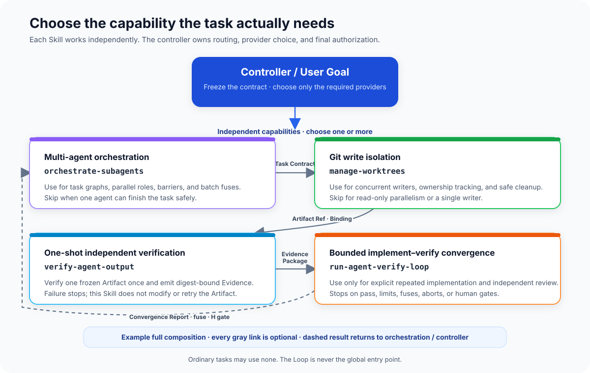

# agentkit

[中文](./README.md) · **English**

A zero-dependency Node.js CLI with four thin skills for agentic software engineering—from task orchestration and Git
worktree isolation to one-shot independent verification and explicit bounded loops.



The diagram starts from request facts and selects independent capabilities. Only multi-agent or multi-node work enters
the `orchestrate-subagents` control plane, which then chooses lightweight or full operation and evidence-driven
rerouting from effective capabilities, task scale, and local model policy. Providers remain independently usable and
compose through frozen Artifact, Binding, and Evidence envelopes.

[Detailed collaboration contracts and safety boundaries (Chinese, v1.0.0)](./docs/architecture/skill-system-architecture.md)

## Included skills

| Skill | Purpose |
| --- | --- |
| [`orchestrate-subagents`](./orchestrate-subagents/) | Decides whether a task should be delegated, builds dependency-aware task contracts, selects suitable agent capabilities, and keeps final acceptance with the controller agent. |
| [`manage-worktrees`](./manage-worktrees/) | Detects write collisions, creates auditable Git worktrees, produces commit-pinned batch integration plans, and safely reclaims worktrees. |
| [`verify-agent-output`](./verify-agent-output/) | Independently verifies one frozen Git Artifact through L0/L1/L0 and emits digest-bound, reviewable Evidence without modifying or retrying the Artifact. |
| [`run-agent-verify-loop`](./run-agent-verify-loop/) | Runs an implementer/verifier loop with isolated context, deterministic checks, evidence tracking, circuit breakers, and human gates. |

This group currently contains four skills. Each works independently and composes through frozen JSON envelopes.
Ordinary tasks need none of them. Use `verify-agent-output` for one-shot verification of a fixed Artifact, and use the
Loop only when bounded repeated implementation and independent re-verification are explicitly requested. Add
orchestration and worktrees only when the task actually needs multiple nodes or Git isolation.

## Installation

### CLI

The CLI requires Node.js 22 or newer:

```bash
npm install -g @cr1992/agentkit
agentkit doctor
```

### Skills

Install all four skills:

```bash
npx skills add https://github.com/cr1992/agentkit.git -g --agent '*'
```

Install a single skill:

```bash
npx skills add https://github.com/cr1992/agentkit.git -g --agent '*' --skill manage-worktrees
```

Replace `manage-worktrees` with any other skill name in the table as needed. After an install or update, start a new
agent task. Some hosts cache skill discovery or contents and may require a restart.

## CLI

The skills only define triggers and invariants. Their deterministic runtime is provided by `agentkit`. Existing 1.x
script entry points remain as compatibility forwarders; new integrations should call the CLI directly:

```bash
agentkit capabilities --json
agentkit doctor --json
agentkit worktree --help
agentkit contract --help
agentkit orchestrate ledger --help
agentkit verify --help
agentkit docs
```

## Usage

Invoke a skill in natural language and state the intended workflow explicitly:

```text
Use orchestrate-subagents to split this feature across multiple agents.
Use manage-worktrees to prepare batch integration acceptance for these feature branches.
Use verify-agent-output to independently verify this fixed commit once and emit Evidence.
Use run-agent-verify-loop so one agent implements and another independently verifies until it passes or a stop condition fires.
```

Each skill adapts to the agents, terminal, Git, and task-control primitives available in the current host. When a
capability is unavailable, follow the documented fallback path instead of assuming a specific agent product or tool
exists.

## Requirements

- Git.
- Node.js 22 or newer.
- A globally available `agentkit` command; run `agentkit doctor` to validate the package version, entry points, and runtime manifest.
- A host with task or sub-agent isolation primitives when actual multi-agent execution is required.

## Local validation

```bash
npm test
npm run pack:check
```

## Repository scope

This repository is the sole source of truth for the `agentkit` CLI, all four skills, canonical schemas, tests, and
architecture documentation. It is no longer generated or overwritten by another repository. See
[source-of-truth and release maintenance](./docs/maintenance/source-of-truth.md) for the ownership boundary.
