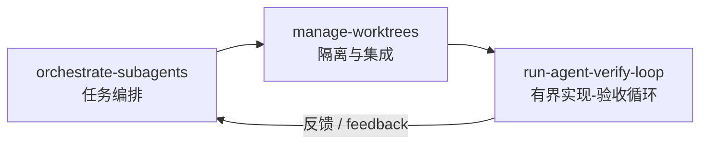

# Awesome Agent Skills

[中文](#中文) · [English](#english)

一组面向多 Agent 软件工程的可复用 Skill：从任务编排、Git worktree 隔离，到独立验收闭环。

A practical collection of reusable skills for multi-agent software engineering—from task orchestration and Git worktree isolation to independent verification loops.



[Agent Skills 协作架构设计（提案）](./docs/architecture/skill-system-architecture.md)

## 中文

### 包含的 Skill

| Skill | 用途 |
| --- | --- |
| [`orchestrate-subagents`](./orchestrate-subagents/) | 判断任务是否值得拆分，设计依赖图与派发契约，选择合适的 Agent 能力，并由主控 Agent 统一验收结果。 |
| [`manage-worktrees`](./manage-worktrees/) | 扫描写入冲突，创建和登记可追踪的 Git worktree，为多个功能分支生成固定提交的批量验收计划，并安全回收 worktree。 |
| [`run-agent-verify-loop`](./run-agent-verify-loop/) | 让实现 Agent 与隔离上下文中的验收 Agent 形成闭环，通过确定性检查、证据台账、熔断和人工门控制收敛。 |

这三个 Skill 可以独立使用，也可以组合成一条完整链路：先编排任务，再隔离并行实现，最后执行独立验收。

### 安装

安装全部 Skill：

```bash
npx skills add https://github.com/cr1992/awesome-agent-skills.git -g --agent '*'
```

只安装一个 Skill：

```bash
npx skills add https://github.com/cr1992/awesome-agent-skills.git -g --agent '*' --skill manage-worktrees
```

将 `manage-worktrees` 替换为另外两个 Skill 名称即可。安装或更新后，建议新建 Agent 任务；部分宿主会缓存 Skill 清单或正文，需要重启后才会加载新版本。

> 私有仓库安装需要本机 Git/GitHub 凭据能够访问该仓库。

### 使用方式

安装完成后，直接用自然语言描述目标，并明确触发对应能力，例如：

```text
用 orchestrate-subagents 把这个功能拆给多个 Agent 并行处理。
用 manage-worktrees 为这些 feature 分支准备一批集成验收。
用 run-agent-verify-loop 让一个 Agent 实现、另一个 Agent 独立验收，直到通过。
```

Skill 会根据当前宿主可用的 Agent、终端、Git 和任务控制能力进行适配。宿主缺少某项能力时，应遵循各 Skill 中的降级路径，而不是假设某个特定产品或工具一定存在。

### 环境要求

- Git。
- Node.js 18 或更高版本（`manage-worktrees` 的辅助脚本）。
- Python 3.9 或更高版本（`orchestrate-subagents` 的模型策略与配置辅助脚本，仅使用标准库）。
- 若要实际派生和隔离多个 Agent，上层宿主需要提供相应的任务或子 Agent 能力。

### 本地验证

```bash
python3 -m unittest discover -s orchestrate-subagents/scripts -p 'test_*.py'
node --test manage-worktrees/scripts/*.test.mjs
```

## English

### Included skills

| Skill | Purpose |
| --- | --- |
| [`orchestrate-subagents`](./orchestrate-subagents/) | Decides whether a task should be delegated, builds dependency-aware task contracts, selects suitable agent capabilities, and keeps final acceptance with the controller agent. |
| [`manage-worktrees`](./manage-worktrees/) | Detects write collisions, creates auditable Git worktrees, produces commit-pinned batch integration plans, and safely reclaims worktrees. |
| [`run-agent-verify-loop`](./run-agent-verify-loop/) | Runs an implementer/verifier loop with isolated context, deterministic checks, evidence tracking, circuit breakers, and human gates. |

The skills work independently or as a stack: orchestrate the work, isolate parallel implementation, then run independent verification.

### Installation

Install all skills:

```bash
npx skills add https://github.com/cr1992/awesome-agent-skills.git -g --agent '*'
```

Install a single skill:

```bash
npx skills add https://github.com/cr1992/awesome-agent-skills.git -g --agent '*' --skill manage-worktrees
```

Replace `manage-worktrees` with either of the other skill names as needed. After an install or update, start a new agent task. Some hosts cache skill discovery or contents and may require a restart.

> Installing from a private repository requires local Git/GitHub credentials with access to it.

### Usage

Invoke a skill in natural language and state the intended workflow explicitly:

```text
Use orchestrate-subagents to split this feature across multiple agents.
Use manage-worktrees to prepare batch integration acceptance for these feature branches.
Use run-agent-verify-loop so one agent implements and another independently verifies until it passes.
```

Each skill adapts to the agents, terminal, Git, and task-control primitives available in the current host. When a capability is unavailable, follow the documented fallback path instead of assuming a specific agent product or tool exists.

### Requirements

- Git.
- Node.js 18 or newer for the `manage-worktrees` helper scripts.
- Python 3.9 or newer for the `orchestrate-subagents` model-policy and configuration helpers; they use only the standard library.
- A host with task or sub-agent isolation primitives when actual multi-agent execution is required.

### Local validation

```bash
python3 -m unittest discover -s orchestrate-subagents/scripts -p 'test_*.py'
node --test manage-worktrees/scripts/*.test.mjs
```

## Repository scope

This repository contains only the three distributable skill directories and repository-level documentation. It does not include the source repository's Git history, unrelated private skills, credentials, or organization-specific configuration.
