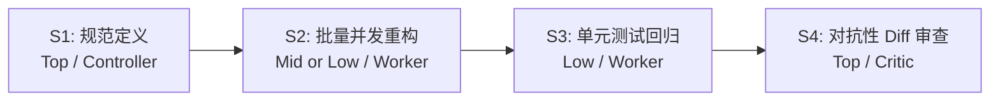

# 任务类型剧本与模型分级（Task-Type Playbooks & Tier Dispatch）

本剧本沉淀了典型多 Agent 协同任务的阶段化模型分级（Tier Dispatch）、角色分配与验收策略。在规划复杂任务图时，Controller 可直接参考本剧本进行节点拆解与模型配置。

---

## 1. 四维难度评估准则（Four-axis Difficulty Rubric）

在为任务图中的各个节点选择本地 tier 时，依据以下四个维度综合评估。`low / mid / top` 只表示
相对决策杠杆，不是配置中必须出现的名称：

| 维度 | 较低 tier 判定依据 | 较高 tier 判定依据 |
|---|---|---|
| **推理深度（Reasoning depth）** | 机械式检索、格式转换、明确规则的脚本执行、模板搬运 | 架构权衡、多步因果推导、隐蔽缺陷发现、系统级设计 |
| **需求模糊度（Spec ambiguity）** | 接口/规范/格式完全固定，输入与输出契约无二义性 | 探索性需求、开放式目标、边界未明、需要主观判断 |
| **爆炸半径（Blast radius）** | 局部叶子节点、单文件只读分析、隔离的单元测试 | 核心公共 API、共享协议、安全边界、不可逆的写操作 |
| **上下文集成度（Context integration）** | 只需关注当前文件或单一输入，无跨模块依赖 | 需要同时综合跨模块历史、系统全局状态与外部规范 |

### 核心分发自问（The Tie-Breaker Question）
> **“如果这个节点产物返回了错误结果，Controller 能否以极低成本（如跑一次已有测试、格式校验或简单 Diff）迅速察觉？”**
> - **能轻易察觉** $\rightarrow$ 选择本地较低 tier，并使用 `worker_self_check`。
> - **难以察觉且后果严重**（如看似合理实则隐蔽的逻辑 bug、失真的 API 契约） $\rightarrow$ 选择本地较高 tier，并使用 `controller_recheck` 或 `independent_evidence`。

---

## 2. 本地 tier 与 effort

模型、effort 默认值和允许范围由用户级 host 配置决定。Controller 可以让较便宜模型运行较高 effort，
也可以让 frontier 模型在边界清楚时使用中等 effort；不要用全局预算模式覆盖所有节点。需要降低成本时，
直接选择仍可可靠完成该节点的较低本地 tier，并收紧节点自己的尝试数或 scope。

---

## 3. 四大核心场景剧本

### 剧本 1：代码批量重构与迁移（Bulk Migration / Refactoring）
**适用场景**：将大批端点/组件从老架构迁移到新规范（如从回调转 async/await、从旧 ORM 迁移到新 client）。

- **S1（规范契约定义）**：`role: judge / controller`, `tier: top`。先撰写 1 页纸的标准迁移范式与防踩坑指南，冻结为任务公共契约（Gating Everything）。
- **S2（批量并发实现）**：`role: worker`, `tier: mid`（若为纯语法规则替换且有测试守护则 `tier: low`）。分批次并行下发，受 Worktree 隔离守护。
- **S3（自动化测试验证）**：`role: worker`, `tier: low`。执行 `npm test` 或测试套件，回传测试证据。
- **S4（对抗性 Diff 审查）**：`role: critic`, `tier: top`。重点审查是否有遗漏的异常分支处理、未清理的资源或微妙的时序问题。
- **成本收益典型特征**：~80% 的 Agent 执行时间消耗在 low/mid 档位。

---

### 剧本 2：安全与代码审计（Repository Bug / Security Audit）
**适用场景**：全仓缺陷排查、依赖漏洞检测或代码质量审计。

- **S1（模块化并行扫描）**：`role: scout`, `tier: low`。按目录/模块拆分并发扫描，要求给出精确的文件行号、可疑片段与触发条件。
- **S2（逐项处方与事实核验）**：`role: critic`, `tier: mid/top`。针对 S1 报告的疑点，对照源码与历史提交进行真实性核验，剔除误报（False Positives）。
- **S3（系统性综合报告）**：`role: controller`, `tier: top`。Controller 亲自综合全景影响，输出带可复核证据链的最终修复清单。

---

### 3. 剧本 3：多源技术与竞品调研（Multi-Source Research）
**适用场景**：对比评估多个技术方案、开源库或竞品特性。

- **S1（单源结构化提取）**：`role: scout`, `tier: low`。每个调研对象指派一个独立 worker，使用统一的 JSON/Markdown 模板结构化提取事实。
- **S2（冲突裁决与对齐）**：`role: critic / worker`, `tier: mid`。对各源之间相互矛盾的性能参数、授权许可或兼容性声明进行交叉核验。
- **S3（综合结论与选型决策）**：`role: judge / controller`, `tier: top`。在 Controller 主会话中整合对比矩阵并给出最终选型建议。

---

### 4. 剧本 4：API 文档与契约编写（Documentation & API Specs）
**适用场景**：为大型模块、SDK 或通用协议补充架构设计与 API 文档。

- **S1（文档结构与规范对齐）**：`role: controller`, `tier: top`。先确定文档目录结构、章节脉络、受众与语调。
- **S2（各章节并发初稿）**：`role: worker`, `tier: mid`。按照代码与现有注释并行起草各章节内容。
- **S3（术语与死链扫描）**：`role: scout`, `tier: low`。执行脚本或简单模型通读，检查代码块格式、死链接与术语统一性。
- **S4（代码一致性核验）**：`role: critic`, `tier: top`。核对文档中的 API 示例代码与实际实现是否 100% 一致（防止“看似流畅但参数过时”的假文档）。

## 规模推导细则

- 扫描数等于真正独立、单个上下文装不下的工作块数；两个 scope 重叠过半就合并。
- 核验数从风险推导，只核「错误会改变最终决策」的条目，不与扫描任务 1:1 配对。核验大多只是确认
  并补细节、很少推翻，说明核多了。
- 快速看一眼用 2-3 个；常规盘点 / 审计一轮扫描任务合并后通常 `4-6` 个；几十个只用于大规模同构 pipeline。
